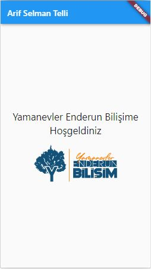

# Yamanevler Enderun Bilişim Projesi Sample 1

Bu proje, Flutter kullanılarak yapılan Yamanevler Enderun Bilişim mobil uygulamasını içerir.

## Kullanılan PC Bilgileri

- Donanım Bilgileri: AMD Ryzen 5 4500X, 32GB Ram, 1TB SSD, RTX 2060
- İşletim Sistemi: Windows 10 Projesi
- Flutter Sürümü: 3.10.x
- Diğer Kullanılan Teknolojiler: ChatGPT, Readme.so, Flutlab.io, Android Studio

---
&copy; Arif Selman Telli. Tüm hakları saklıdır.
